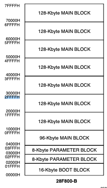

# M6000 Boot reverse

## Intro

My TC Electronic M6000 does not boot anymore, I'm reversing the boot firmware in order to understand where it crashes.

Symptoms:

  - Front panel led is still RED
  - Internal leds are: on off off blink
  - Floppy disk drive is never accessed (so it probably crashes before this part of the code)

## Reverse:

As far as I understand, the M6000 mainboard is based on:

  - an H8/3003 16 bits microcontroller 
  - with 2 SRAM chips (odd/even).
  - an Intel 28F800 flash used to store the firmware
  - a 93C46 SPI EEPROM (usage is still unknown)

The H8 is in charge of the boot process and control over the main bus used to communicate with the FPGA, the DSPs (over the bus connector) and the floppy disk drive controler.
This repository is about the firmware reverse only, details on the electronics part can be found here: https://radix-studio.fr/blog/2022/03/10/going-deeper-on-the-m6000/

## Flash Memory

H8 boots on a E28F800 B5B70 memory chip.
Since we're on x16 Mode bottom boot, memory map is:

Since our firmware is 196608 bytes, in 16bits adressing mode we go up to 0x2FFFF. Our firmware seems to be flashed "as-it" and fills:

  - The  16KB boot block (from 0x0000 to 0x1FFF)
  - The first 8KB parameters block (from 0x2000 to 0x2FFF)
  - The second 8KBboot block (from 0x3000 to 0x3FFF)
  - The 96KB main block (from 0x4000 to 0xFFFF) 

## BUS

When accessing the __Flash chip__ (28F800):

  - FLASH_CS is set to 0
  - Address is set using A1-A20
  - Value is read/written using D0-D15

When default dip switches settings is used, FLASH_CS is actually BOOT_CS and connected to H8 pin 104: CS0/P84
Port 8 direction can be set using register xFFCD, by setting bit 4 to 1.
Port 8 value can be set using register xFFCF, byt setting bit 4.

When accessing the __SRAM chips__:

  - SRAM_CS is set to 0
  - Address is set using A1-A17
  - Value is read/written using D8-D15

SRAM_CS is actually CS1_RAM and connected to H8 pin 103: CS1/P83

When accssing the floppy disk drive:

  - FD_CS is set to 0
  - Address is set using A0-A2
  - Value is read/written using D8-D15

FD_CS is actually CS5_FLOPPY and connected to H8 pin 14: CS5/PC3

When accessing the __PCMCIA port__:

    - PCMCIA_CS is set to 0
    - Address is set using A0-A20
    - Value is read/written using D8-D15

PCMCIA_CS is actually controlled in addition to PCMCIA_REG_CS by the FPGA.

## H8/3003 IO

| PIN | Label         | Destination                                                         |
| --- | ------------- | ------------------------------------------------------------------- |
| P60 | "WAIT"        | FPGA:BUS_ACK and PCMCIA:PCM_WAIT and FLASH:WAIT                     |
| P61 | ""            | FLASH:P61                                                           |
| P62 | ""            | FLASH:P62                                                           |
| P80 | "IRQ_FD"      | FD:IRQ                                                              |
| P81 | "CS_PCM_REG"  | FPGA:PCM_REG_CS +(?) FLOPPY:PCM_REG_CS                              |
| P82 | "CS_PCM_MEM"  | Switch 1B to FPGA:PCM_BUS_CS OR Switch 1D to FLASH:FLASH_CS         |
| P83 | "CS_SRAM"     | MAX693 to "SRAM_CS" to  FLASH:"SRAM_CS"                             |
| P84 | "CS_BOOT"     | Switch 1A to "FLASH_CS" to FLASH:CS OR Switch 1C to FPGA:PCM_BUS_CS |
| P90 | "REM_TX"      | ExternalItf:TXD0 (out)                                              |
| P91 | "MIDI_TX"     | ExternalItf:TXD1 (out)                                              |
| P92 | "REM_RX"      | ExternalItf:RXD0 (in)                                               |
| P93 | "MIDI_RX"     | ExternalItf:RXD1 (in)                                               |
| P94 | "DCD0"        | ExternalItf:DCD0 (in)                                               |
| P95 | "HAND_S_REM"  | ExternalItf:HAND_S_REM  (out)                                       |
| PC0 | "SEE_CS"      | 93C46 EEPROM to EEPROM:CS (out)                                     |
| PC1 | "SEE_CLK"     | 93C46 EEPROM to EEPROM:CLK (out)                                    |
| PC2 | "CS_BUS"      | FPGA:BUS_CS (out)                                                   |
| PC3 | "CS_FLOPPY"   | FLOPPY:FS_CS (out) AND FPGA:FS_CS (out)                             |
| PC4 | "CS_OPT_CS"   | FLASH:OPT_CS (out)                                                  |
| PC5 | "SEE_DO"      | 93C46 EEPROM to EEPROM:DO (in)                                      |
| PC6 | "BUS_IRQ"     | BUS_INTERFCE:BUS_IRQ (in)                                           |
| PC7 | "PCM_IRQ"     | PCMCIA:PCMCIA_IRQ (in)                                              |
| PA0 | "FD_TEND"     | FLOPPY:FD_TEND (out) AND FPGA:TEND (out)                            |
| PA1 | "X-DETECT"    | J4:4/5V (in?)                                                       |
| PA2 | "SMPTE-IN"    | ExternalItf:SMPTE_IN (in)                                           |
| PA3 | ""            | J4:3                                                                |
| PA4 | ""            | J4:2 AND LED4/ => Always on                                         |
| PA5 | ""            | LED3/                                                               |
| PA6 | ""            | LED2/                                                               |
| PA7 | ""            | LED1/  => blink182                                                  |
| PB0 | NC            |                                                                     |
| PB1 | "SEE_DI"      | 93C46 EEPROM to EEPROM:DI (out)                                     |
| PB2 | "F_WP"        | FLASH:F_WP (out) => "désactive la sécurité du boot block"           |
| PB3 | "EN_485"      | ExternalItf:EN_485 (out)                                            |
| PB4 | "OE_485"      | ExternalItf:OE_485 (out)                                            |
| PB5 | "WATCH_DOG"   | MAX693:WDI (out)                                                    |
| PB6 | "FD_DREQ"     | FLOPPY:FD_DREQ (in) AND FPGA:FD_DREQ (in)                           |
| PB7 | "BATT_TEST"   | battery                                                             |
| P70 | NC            |                                                                     |
| P71 | "-5V"         | BUS_INTERFACE:-5V (in)                                              |
| P72 | "V-BATT"      | battery                                                             |
| P73 | NC            |                                                                     |
| P74 | "REM_VCC"     | ExternalItf:REM_VCC (in)                                            |
| P75 | "WP"          | PCMCIA:WP (in)                                                      |
| P76 | "F_RY/BY"     | FLASH:F_RY/BY                                                       |
| P77 | "PEDAL"       | ExternalItf:PEDAL (in)                                              |

